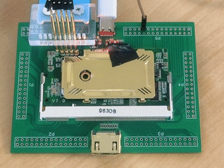

# LED



This example uses the on-board LED. Configure which pattern you want to generate by uncommenting the appropriate line in `Makefile`.

Then simply
```
make
make prog
```
`make prog` uses the programmer included on the extension board (the one with PMOD connectors and a USB-C port), which is pretty slow (almost 22s), I also included `make prog-blaster` in the Makefile because I had an external Altera USB Blaster clone lying around, with which I managed bring the upload time down to 4.5s. Edit: I realized bitstream compression was disabled, enabling it brought the upload times down to 3.9s and 0.8s, respectively.
