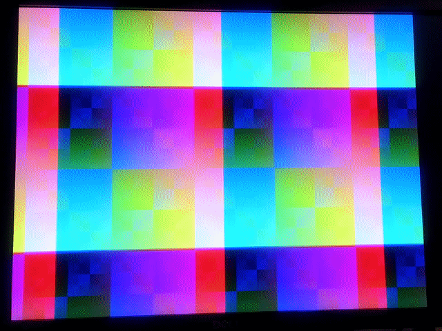
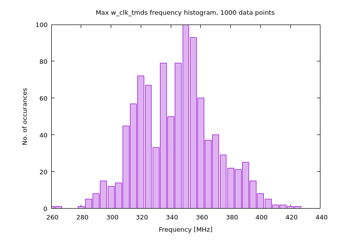

# Video



This example uses the "HDMI" connector on the expansion board. While the connector itself does fit standard HDMI cables, the HDMI standard has some pretty stringent requirements which are pretty much impossible to meet using this board (and some not-so-stringent ones, such as DC coupling on the physical layer, which the expansion board does not do). Above all, expensive HDMI compliance testing (and a licensing fee) is required if you want to say your device has HDMI. With all that in mind, the digital video interface on this board is certainly *not* HDMI, so use it at your own risk. That being said, encoding video data with TMDS and routing it to the connector will probably yield an image on a connected monitor, so this is what the examples here do. If you're reading this, it means I've successfully done just that on my setup, but again, as with all code in this repo, build and upload it at your own risk.

With that out of the way, you know the drill by now - choose which sub-example you want by uncommenting the appropriate line in `Makefile`, then
```
make
```

```
make prog
```
or
```
make prog-blaster
```

The video output is single data rate for now, which means I struggled to hit the 250 MHz max frequency for w_tmds_clk for a while, unitl I optimized `video_encoder.vhd`. Since I was already playing around with timing, I wrote `timing.sh` to compare code performance - it runs nextpnr a bunch of times and plots a histogram of max w_tmds_clk frequency, here's one based on 1000 runs (took just a bit over 20 minutes):



The sub-examples are as follows:
- `blank` - just a blank 640x480 60(-ish)Hz screen
- `test_pattern` - a very simple animated XOR pattern

Big thanks to [splinedrive/my_hdmi_device](https://github.com/splinedrive/my_hdmi_device) and everyone who had anything to do with all the resources linked there, including [this fpga4fun post](https://www.fpga4fun.com/HDMI.html).
